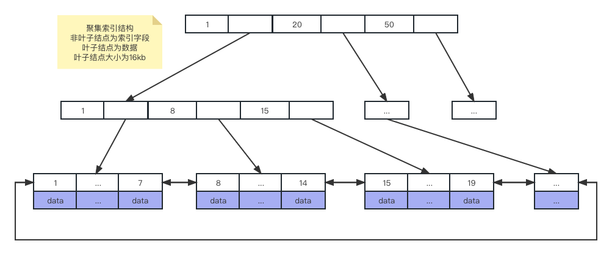

* 索引的定义：**索引是帮助mysql高效获取数据的排好序的数据结构**
* mysql如何使用索引：
  * [官方说明](https://dev.mysql.com/doc/refman/8.0/en/mysql-indexes.html)：索引用于快速查找具有特定列值的行。如果没有索引，MySQL必须从第一行开始，然后通读整个表以找到相关行。桌子越大，成本就越高。如果表有相关列的索引，MySQL可以快速确定在数据文件中间查找的位置，而无需查看所有数据。这比按顺序读取每一行要快得多。
  * mysql会在表中创建索引，索引是一个单独的文件，索引文件由数据文件和索引文件组成
  * mysql会根据表中的数据，以某种规则生成索引，然后将索引和数据一起存放到磁盘上
  * 当mysql需要查询数据时，会先根据索引文件找到对应的索引，然后根据索引找到数据文件，最后读取数据文件获取数据
* 索引的优缺点：
  * 优点：提高查询效率，降低排序成本，降低IO成本
  * 缺点：降低更新效率，占用物理空间，降低写效率
* 索引的结构：
  * **mysql的InnoDB的表只会有一个聚集索引，其他都为二级索引**
  * mysql使用B+树的变种实现索引 
    * 非叶子节点不存储data(数据)，只存储索引
    * 叶子节点包含所有的索引字段
    * 叶子节点使用双向指针
    * 非叶子节点常驻内存(看版本)
    * 文件页为16KB
      * 一次磁盘I/O将一页数据load到内存进行筛选
      * 依次定位到data取数据
      * 一页索引可以存储约1170
      * 叶子结点存储16以上
      * 高度为3的数 可以存储2000万+数据
    * data为所在行的磁盘指针(MYISAM 非聚集索引:索引与数据分开存放)或者行数据(InnoDB 聚集索引:结点包含全部数据)
  * 聚集索引结构图
    
* 索引的分类：
  * 单值索引：一个索引只包含单个列，一个表可以有多个单列索引
  * 唯一索引：索引列的值必须唯一，但允许有空值
  * 复合索引：一个索引包含多个列
  * 前缀索引：对字符串的前缀建立索引
  * 全文索引：对文本的内容建立索引
  * 空间索引：对空间数据类型的列建立索引